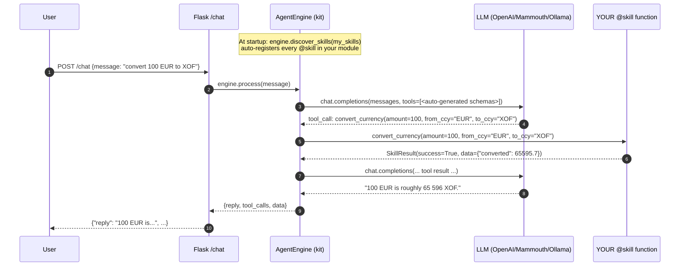
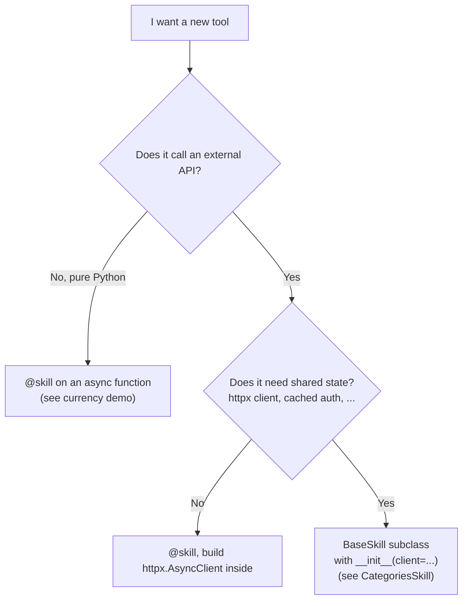

# Adding a new skill (the obvious way)

> **TL;DR.** A skill = an `async` Python function decorated with
> `@skill`. Drop it in *your project's* `my_skills.py`, point the
> service at that module, done. **You never edit anything inside the
> kit itself.**

---

## The 3-file mental model

Every project that uses `llm-search-kit` looks like this:

```
my_project/
├── my_skills.py     ← YOUR skills (one @skill function per tool)
├── service.py       ← 30 lines: build the Flask app
└── run.py           ← entrypoint
```

That's the whole surface area you maintain. The kit ships an
identical-shape **starter template** at
[`llm_search_kit/examples/starter/`](../llm_search_kit/examples/starter/) —
copy that folder and you're 90% done.

---

## The flow when a request comes in



Two things to notice:

- The kit auto-generated the tool's JSON Schema from your function
  signature (Pydantic does the heavy lifting). You did not write any
  schema by hand.
- The kit handled the multi-turn LLM conversation, the JSON parsing,
  the dispatch, the parallel execution if the LLM picked several tools
  at once, and the error envelope. You wrote ~10 lines of Python.

---

## Recipe: write your `my_skills.py`

```python
from typing import Any, Dict, Optional

from pydantic import Field

from llm_search_kit import SkillResult, skill


@skill(description="Look up a customer by id.")
async def get_customer(
    customer_id: int = Field(..., description="Internal customer id."),
    include_orders: bool = Field(False, description="Embed the customer's orders."),
    ctx: Optional[Dict[str, Any]] = None,   # optional: per-request context
) -> SkillResult:
    tenant = (ctx or {}).get("tenant", "default")
    # ...your real lookup here (DB, HTTP, gRPC, file system, anything)...
    return SkillResult(success=True, data={"customer": {...}})
```

The 4 things that matter:

| Element | Why it matters |
|---|---|
| `@skill(description="...")` | The **LLM reads this verbatim** to decide whether to call the tool. Be explicit: *what does the tool do, when should the LLM use it, when should it not.* |
| `Field(..., description="...")` | Each parameter's description is shown to the LLM. The leading `...` means *required*; replace with a value (`Field(50, ...)`) to make it optional. |
| Type annotations | Pydantic validates and coerces the LLM's JSON-ish input. Use `int`, `str`, `bool`, `float`, `Literal["a","b"]`, nested `BaseModel`s — anything Pydantic supports. |
| Return `SkillResult` | Or return a `dict` and the decorator wraps it for you. Use `success=False, error="..."` to tell the LLM something went wrong (it can then apologise / retry / ask for clarification). |

---

## Recipe: wire it in `service.py`

```python
from llm_search_kit.examples.flask_server.app import create_app as create_flask_app
from . import my_skills

SYSTEM_PROMPT = """You are <YourBot>, a friendly assistant.
When the user asks something a tool can answer, ALWAYS call the tool
instead of guessing."""


def make_app(*, llm_client=None):
    return create_flask_app(
        system_prompt=SYSTEM_PROMPT,
        skills_module=my_skills,            # ← auto-discovers all @skill functions
        enable_default_search_skill=False,  # ← True only if you have a CatalogBackend
        llm_client=llm_client,
    )
```

That is the entire wiring. **Adding a tool now means adding one
function to `my_skills.py` and restarting**. You never touch:

- `engine.py` — the orchestrator
- `flask_server/app.py` — the HTTP layer
- `soul.md` / `system_prompt` — the LLM picks the new tool from its
  description, no prompt changes needed
- `schema.py` — only relevant if you use the built-in `search_catalog`
  skill (you don't, in this flow)

---

## Decision tree: which skill style to use?



- **`@skill` decorator** — recommended default. ~10 lines per tool.
- **`BaseSkill` subclass** — when you need a constructor (shared HTTP
  client, auth headers, normalisation helpers). See
  [`examples/beasyapp_backend/categories_skill.py`](../llm_search_kit/examples/beasyapp_backend/categories_skill.py)
  for the canonical 200-line template.

Both styles plug into discovery the same way: as long as the symbol
lives at module top level, `engine.discover_skills(module)` picks it up.

---

## Common gotchas

| Symptom | Cause | Fix |
|---|---|---|
| `@skill: missing description` | Decorator has no description and the function has no docstring | Add `@skill(description="...")` or a docstring. The LLM needs *some* description. |
| `model_unsupported_tooling` (HTTP 422) | Your LLM model doesn't support function-calling (e.g. plain `llama3` on Ollama) | Switch to a tool-capable model: `qwen2.5`, `mistral-nemo`, `llama3.1`, or any OpenAI/Mammouth/Groq model. See [GETTING_STARTED.md](../GETTING_STARTED.md) §10. |
| LLM never calls the tool | `description=` is too vague. Or your `system_prompt` says "answer directly". | Sharpen the description: explicit verbs, examples of *when to call it*. |
| LLM passes wrong argument types | Type annotations missing on your function | Annotate every parameter; Pydantic coerces `"42"` → `42` only when the type is `int`. |
| `discover()` finds 0 skills | Your skills are nested inside a class, defined at function scope, or imported from another module | Expose them at module top-level. Re-exports are intentionally skipped (see `_coerce_to_skill` in `registry.py`). |

---

## Where to read next

- [`docs/INTEGRATION.md`](INTEGRATION.md) — full integration guide if
  you also want the built-in product-search skill on top of your own
  catalog (Elasticsearch, REST API, etc.).
- [`HANDOVER.md`](../HANDOVER.md) — long-form FAQ from real
  integrations (Beasy, FarmCover) including OpenAPI auto-generation
  roadmap and observability hooks.
- [`llm_search_kit/examples/starter/`](../llm_search_kit/examples/starter/)
  — the canonical "copy this folder" template the recipes above are
  based on.
